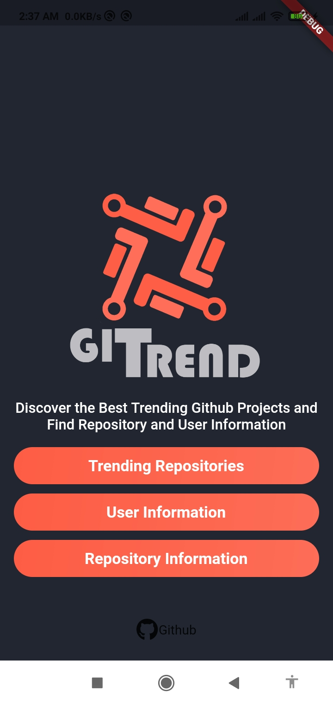
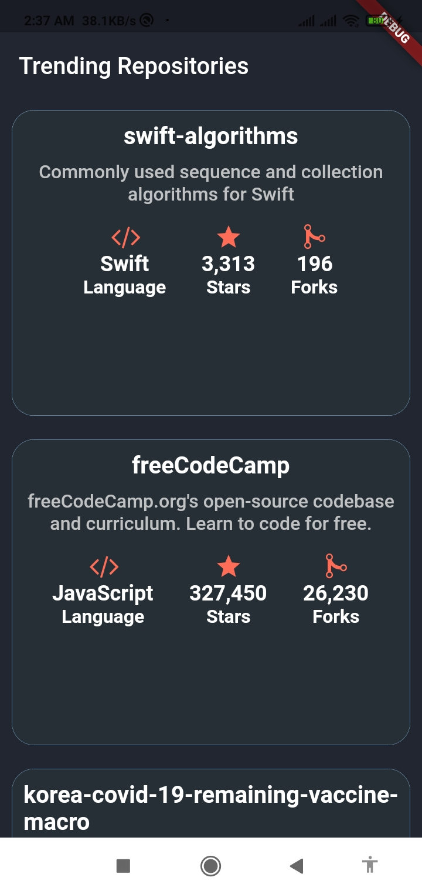

  

 Discover the Best Trending Github Projects and Find Repository and User Information
 
  

## Table of Contents
+ [Screenshots](#screenshots)
+ [Todo](#todo)
+ [License](license)

## Screenshots 

 
  

## Todo 
- [x] Trending Repositories
- [ ] User Information
- [ ] Repository Information

